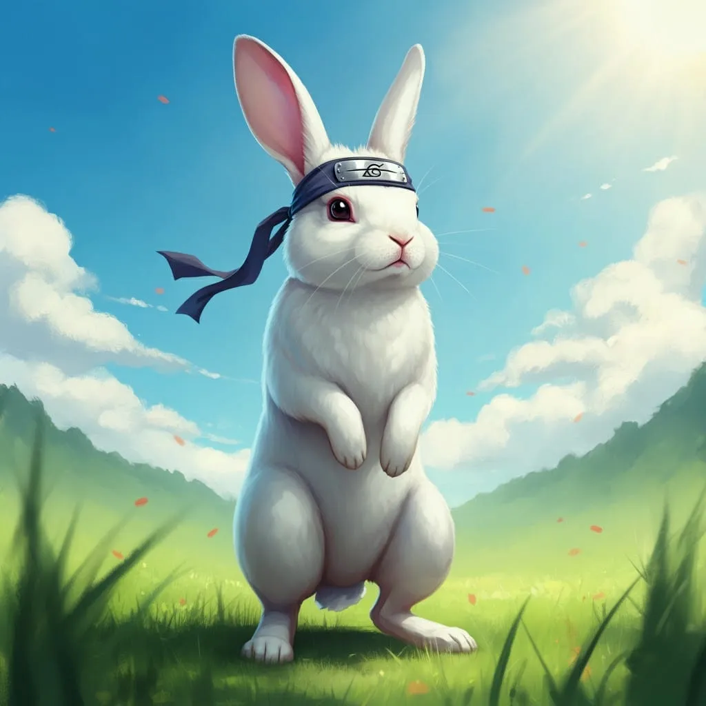
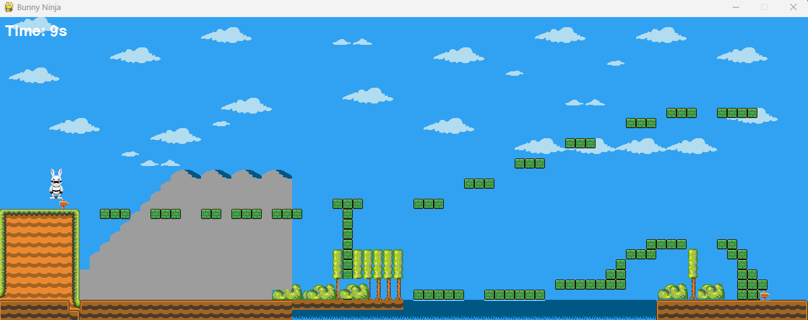

  
  

This was my first attempt at a platformer game using python. I used the pygame module and tiled to finish this project. Here is a snippet of the code showing how the sprites class was defined:

class Sprite(pygame.sprite.Sprite):   #creating the class and allowing inheritance from parent class.
    def __init__(self, pos, surf, groups): #three paramaters for each instance
        super().__init__(groups) #places in parent group
        self.image = surf 
        self.rect = self.image.get_rect(topleft=pos)
        self.old_rect = self.rect.copy()   # last three lines are assigning values to specific paramaters. self.old_rect is used to keep track of the sprites previous positions and creating collision. 

